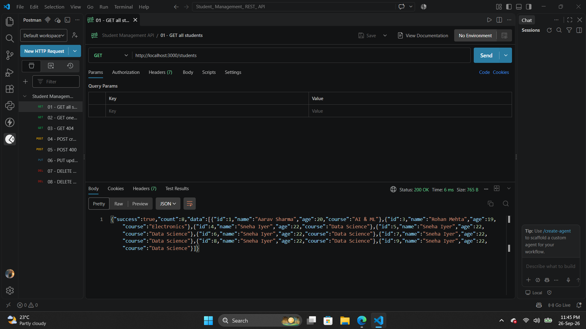
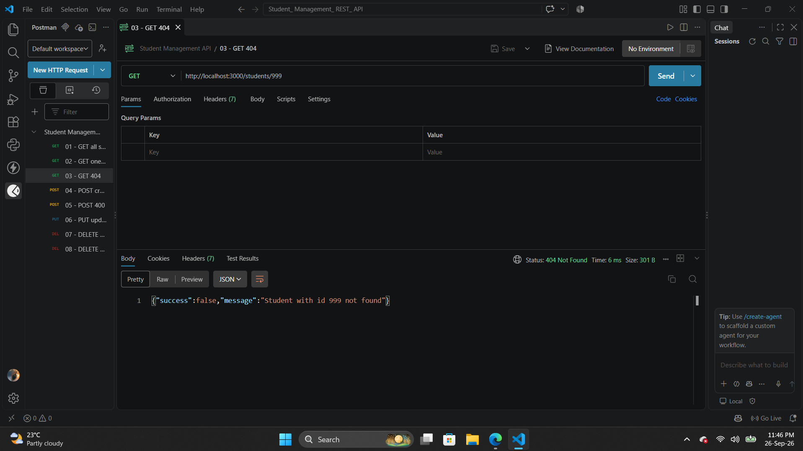
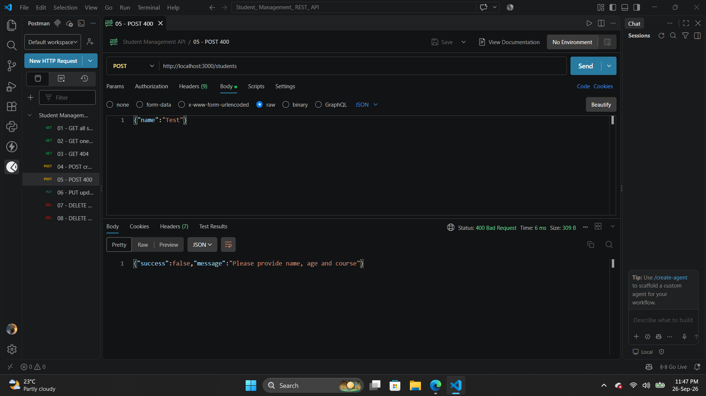
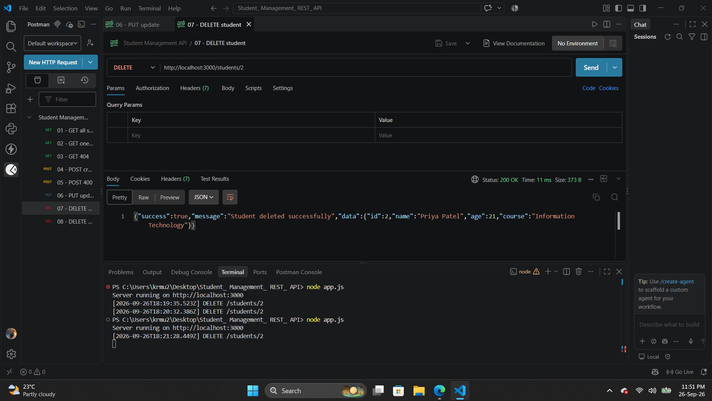
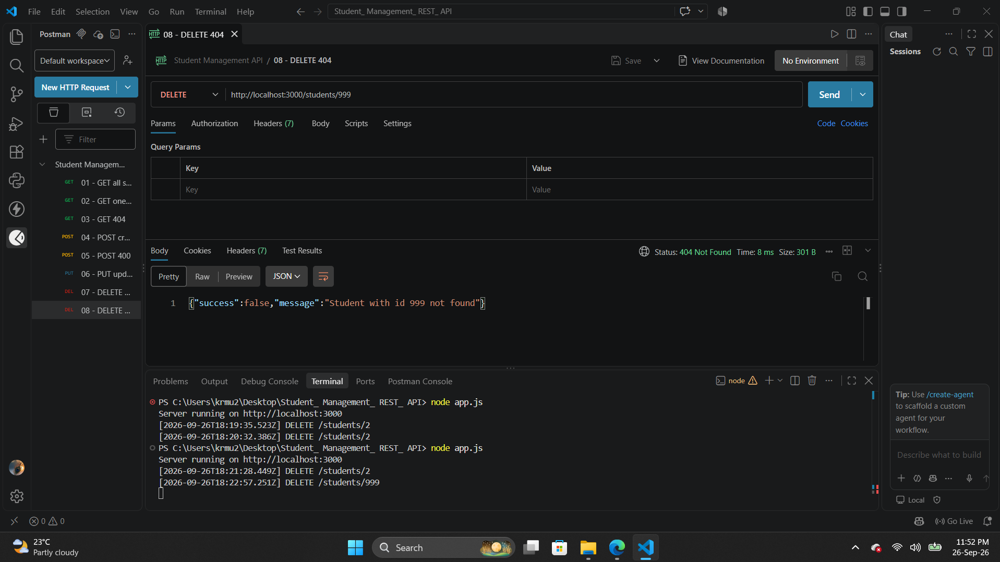

# Student Management REST API

A RESTful API built with **Node.js** and **Express.js** for managing student records using CRUD operations. Built as part of Web Dev III (Node.js & Express Backend) - Lab Assignment 2.

## Tech Stack
- Node.js
- Express.js
- Postman (for testing)

Note: This project uses no database. All student records are stored in an in-memory JavaScript array inside `data/students.js`.

## Features
- Create, Read, Update, Delete (CRUD) operations
- Custom logger middleware for request logging
- Modular routing using express.Router()
- Proper HTTP status codes (200, 201, 400, 404, 500)
- Centralized error handling

## Project Structure

    Student_ Management_ REST_ API/
    |-- app.js
    |-- package.json
    |-- routes/
    |   |-- studentRoutes.js
    |-- middleware/
    |   |-- logger.js
    |-- data/
    |   |-- students.js
    |-- screenshots/
        |-- 01-get-all.png
        |-- 02-get-one.png
        |-- 03-get-404.png
        |-- 04-post-create.png
        |-- 05-post-400.png
        |-- 06-put-update.png
        |-- 07-delete-200.png
        |-- 08-delete-404.png

## Installation

1. Clone the repository
2. Install dependencies: `npm install`
3. Start the server: `node app.js`
4. Server runs on http://localhost:3000

## API Endpoints

| Method | Endpoint | Description | Status Codes |
|--------|----------|-------------|--------------|
| GET | /students | Get all students | 200 |
| GET | /students/:id | Get single student | 200, 404 |
| POST | /students | Create new student | 201, 400 |
| PUT | /students/:id | Update student | 200, 400, 404 |
| DELETE | /students/:id | Delete student | 200, 404 |

## Error Handling

| Status Code | Meaning | When Returned |
|-------------|---------|---------------|
| 200 | OK | Successful GET / PUT / DELETE |
| 201 | Created | Successful POST |
| 400 | Bad Request | Missing required fields |
| 404 | Not Found | Student ID does not exist |
| 500 | Internal Server Error | Unexpected server error |

## Postman Test Screenshots

### 1. GET All Students - 200 OK

### 2. GET One Student - 200 OK

### 3. GET Invalid Student - 404 Not Found

### 4. POST Create Student - 201 Created

### 5. POST Missing Fields - 400 Bad Request

### 6. PUT Update Student - 200 OK

### 7. DELETE Student - 200 OK

### 8. DELETE Invalid Student - 404 Not Found

## Author

**Vicky Saini**
- GitHub: @Vicky0079
- Email: vickylucky00079@gmail.com

**Course:** Web Dev III (Node.js & Express Backend)
**Assignment:** Lab Assignment 2 - Student Management REST API